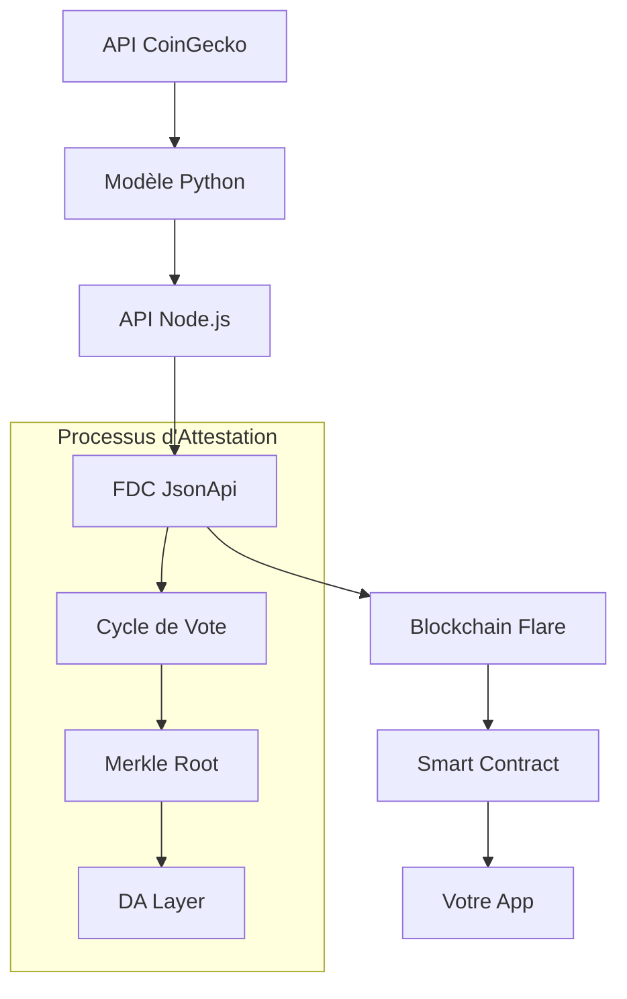

# 🌟 Guide d'Intégration Flare Data Connector (FDC)

Ce guide explique comment utiliser l'intégration Flare Data Connector pour stocker et récupérer les recommandations Aave vs Morpho on-chain.

## 🎯 Vue d'ensemble

L'intégration permet de :
1. **Générer** des recommandations via le modèle Python `model.py`
2. **Soumettre** ces données au Flare Data Connector (FDC) pour attestation
3. **Stocker** les données attestées dans un smart contract
4. **Récupérer** les données vérifiées on-chain pour utilisation dans votre app

## 🏗️ Architecture



## 🚀 Configuration Initiale

### 1. Variables d'environnement

Copiez `flare.env.example` et ajoutez ces variables à votre `.env` :

```bash
# Flare Coston2 testnet
FLARE_RPC_URL=https://coston2-api.flare.network/ext/bc/C/rpc
PRIVATE_KEY=your_private_key_here
FLARE_DA_URL=https://da-layer.flare.network/api/v1
```

### 2. Obtenir des tokens de test

Visitez le faucet Flare pour obtenir des tokens COSTON2 :
```
https://faucet.flare.network/coston2
```

### 3. Installer les dépendances

```bash
npm install ethers@^6.8.0
```

### 4. Installer Python et dépendances

```bash
pip install requests
```

## 📋 Endpoints Disponibles

### API de Base

| Endpoint | Méthode | Description |
|----------|---------|-------------|
| `/api/aave-morpho-recommendation` | GET | Génère une recommandation via le modèle Python |
| `/api/all-metrics` | GET | Récupère toutes les métriques crypto |

### Flare Data Connector

| Endpoint | Méthode | Description |
|----------|---------|-------------|
| `/flare/generate-and-submit` | POST | Génère et soumet une recommandation au FDC |
| `/flare/attested-recommendation` | GET | Récupère les données attestées |
| `/flare/network-status` | GET | Statut du réseau Flare |
| `/flare/complete-workflow` | POST | Workflow complet (génération → FDC → contrat) |

### Smart Contract

| Endpoint | Méthode | Description |
|----------|---------|-------------|
| `/flare/contract/recommendation` | GET | Dernière recommandation du contrat |
| `/flare/contract/should-follow` | GET | Vérifie si recommandation doit être suivie |
| `/flare/contract/is-fresh` | GET | Vérifie si la recommandation est récente |
| `/flare/contract/history` | GET | Historique des recommandations |

## 🔄 Workflows

### Workflow 1 : Génération Simple

```bash
# 1. Générer une recommandation
curl http://localhost:3000/api/aave-morpho-recommendation

# Réponse exemple :
{
  "success": true,
  "data": {
    "suggestion": "AAVE",
    "confidence": 0.65,
    "scores": {
      "aave": 0.8,
      "morpho": 0.6
    },
    "btc_dominance_pct": 52.3,
    "defi_tvl_usd": 120000000000,
    "timestamp": "2024-01-15T10:30:00.000Z"
  }
}
```

### Workflow 2 : Soumission au FDC

```bash
# 1. Soumettre au FDC
curl -X POST http://localhost:3000/flare/generate-and-submit

# Réponse :
{
  "success": true,
  "data": {
    "transactionHash": "0x123...",
    "timestamp": 1705320600,
    "attestationType": "0xabc...",
    "sourceId": "0xdef..."
  }
}
```

### Workflow 3 : Récupération des Données Attestées

```bash
# 1. Attendre 5-10 minutes pour la finalisation
# 2. Récupérer les données attestées
curl "http://localhost:3000/flare/attested-recommendation?apiUrl=http://localhost:3000/api/aave-morpho-recommendation&timestamp=1705320600"

# Réponse :
{
  "success": true,
  "proved": true,
  "data": {
    "suggestion": "AAVE",
    "confidence": 0.65,
    "scores": { "aave": 0.8, "morpho": 0.6 }
  }
}
```

### Workflow 4 : Interaction avec le Smart Contract

```bash
# 1. Déployer le contrat (simulation)
node scripts/deploy.js

# 2. Récupérer les informations du contrat
curl http://localhost:3000/flare/contract/info

# 3. Obtenir la dernière recommandation
curl http://localhost:3000/flare/contract/recommendation

# 4. Vérifier si on doit suivre la recommandation (confiance >= 60%)
curl "http://localhost:3000/flare/contract/should-follow?minConfidence=600"
```

## 🔧 Utilisation Avancée

### 1. Écouter les Événements du Contrat

```javascript
const contractService = require('./src/services/contractService');

// Démarrer l'écoute
await contractService.startListeningToEvents((event) => {
  console.log('Nouvelle recommandation:', event);
  // Logique métier ici
});
```

### 2. Vérification des Données avec Preuve Merkle

```bash
curl -X POST http://localhost:3000/flare/verify-attestation \
  -H "Content-Type: application/json" \
  -d '{
    "merkleRoot": "0x123...",
    "merkleProof": ["0xabc...", "0xdef..."],
    "data": "{\"suggestion\":\"AAVE\",\"confidence\":0.65}"
  }'
```

### 3. Historique des Attestations

```bash
# Récupérer l'historique depuis le bloc 1000
curl "http://localhost:3000/flare/contract/history?fromBlock=1000"
```

## 🔒 Sécurité et Bonnes Pratiques

### 1. Gestion des Clés

- ⚠️ **Testnet uniquement** : N'utilisez jamais vos clés mainnet
- 🔐 **Variables d'environnement** : Stockez les clés privées dans `.env`
- 🚫 **Pas de commit** : Ajoutez `.env` à `.gitignore`

### 2. Validation des Données

```javascript
// Toujours vérifier la fraîcheur des données
const freshCheck = await fetch('/flare/contract/is-fresh?maxAge=3600');
const { isFresh } = await freshCheck.json();

if (!isFresh) {
  console.warn('Données trop anciennes, générer une nouvelle recommandation');
}
```

### 3. Gestion des Erreurs

```javascript
try {
  const response = await fetch('/flare/contract/recommendation');
  const data = await response.json();
  
  if (!data.success) {
    // Fallback vers l'API directe
    const fallback = await fetch('/api/aave-morpho-recommendation');
    return await fallback.json();
  }
  
  return data;
} catch (error) {
  console.error('Erreur FDC:', error);
  // Logique de fallback
}
```

## 🧪 Tests et Débogage

### 1. Test de l'API

```bash
# Santé générale
curl http://localhost:3000/

# Test du modèle Python
curl http://localhost:3000/api/aave-morpho-recommendation

# Test de connexion Flare
curl http://localhost:3000/flare/network-status
```

### 2. Débogage Common Issues

| Problème | Solution |
|----------|----------|
| `PRIVATE_KEY required` | Ajoutez votre clé privée dans `.env` |
| `Python execution error` | Vérifiez que Python3 et requests sont installés |
| `Contract not initialized` | Le contrat n'est pas déployé ou l'adresse est incorrecte |
| `Attestation not yet available` | Attendez 5-10 minutes pour la finalisation FDC |

### 3. Logs Utiles

```bash
# Logs du serveur avec détails FDC
NODE_ENV=development npm run dev

# Logs Python
python3 model.py http://localhost:3000/api/temp-model-data
```

## 🚀 Déploiement en Production

### 1. Configuration Production

```bash
# .env.production
NODE_ENV=production
FLARE_RPC_URL=https://flare-api.flare.network/ext/bc/C/rpc  # Mainnet
PRIVATE_KEY=your_production_key
```

### 2. Déploiement Railway

```bash
# Ajouter les variables d'environnement sur Railway
railway variables set FLARE_RPC_URL=https://coston2-api.flare.network/ext/bc/C/rpc
railway variables set PRIVATE_KEY=your_key_here

# Déployer
git push origin main
```

## 📊 Monitoring

### Métriques Importantes

1. **Fraîcheur des données** : Age des recommandations
2. **Taux de succès FDC** : Attestations réussies vs échouées
3. **Confiance moyenne** : Qualité des recommandations
4. **Latence FDC** : Temps entre soumission et finalisation

### Dashboard de Monitoring

```javascript
// Exemple d'endpoint de monitoring
app.get('/health/flare', async (req, res) => {
  const [contractInfo, networkStatus, lastRecommendation] = await Promise.all([
    contractService.getContractInfo(),
    flareService.getNetworkStatus(),
    contractService.getLatestRecommendation()
  ]);
  
  res.json({
    contract: contractInfo.success,
    network: networkStatus.success,
    hasRecommendation: lastRecommendation.success,
    timestamp: new Date().toISOString()
  });
});
```

## 🔗 Liens Utiles

- [Documentation Flare FDC](https://dev.flare.network/fdc/)
- [Faucet Coston2](https://faucet.flare.network/coston2)
- [Explorer Coston2](https://coston2-explorer.flare.network/)
- [Discord Flare](https://discord.gg/flare-network)

## 💡 Exemples d'Intégration

### React Frontend

```jsx
import { useState, useEffect } from 'react';

function RecommendationWidget() {
  const [recommendation, setRecommendation] = useState(null);
  
  useEffect(() => {
    async function fetchRecommendation() {
      try {
        // Essayer le contrat d'abord
        const contractRes = await fetch('/flare/contract/recommendation');
        const contractData = await contractRes.json();
        
        if (contractData.success) {
          setRecommendation(contractData.data);
        } else {
          // Fallback vers l'API
          const apiRes = await fetch('/api/aave-morpho-recommendation');
          const apiData = await apiRes.json();
          setRecommendation(apiData.data);
        }
      } catch (error) {
        console.error('Erreur:', error);
      }
    }
    
    fetchRecommendation();
  }, []);
  
  if (!recommendation) return <div>Chargement...</div>;
  
  return (
    <div className="recommendation-card">
      <h3>Recommandation: {recommendation.suggestion}</h3>
      <p>Confiance: {(recommendation.confidence * 100).toFixed(1)}%</p>
      <p>Score Aave: {recommendation.scores.aave}</p>
      <p>Score Morpho: {recommendation.scores.morpho}</p>
    </div>
  );
}
```

---

🎉 **Félicitations !** Vous avez maintenant une intégration complète entre votre modèle Python, l'API CoinGecko, le Flare Data Connector et un smart contract pour des recommandations DeFi on-chain sécurisées !
